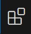
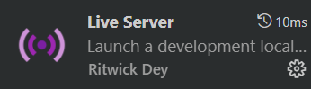

<!-- omit in toc -->
# Atelier Web en RedemArts
<!-- omit in toc -->
## Table des matières
- [Introduction](#introduction)
- [Installer votre éditeur de code](#installer-votre-éditeur-de-code)
- [HTML](#html)
  - [La structure HTML de base](#la-structure-html-de-base)
  - [Les balises HTML](#les-balises-html)
    - [La balise `<title>`](#la-balise-title)
    - [Les balises `<h1>`, `<h2>`, `<h3>`, `<h4>`, `<h5>`, `<h6>`](#les-balises-h1-h2-h3-h4-h5-h6)
    - [La balise image ``](#la-balise-image-img)
    - [Les listes ordonnées `<ol>` et les éléments de liste `<li>`](#les-listes-ordonnées-ol-et-les-éléments-de-liste-li)
    - [Les liens `<a>` et l'attribut ID](#les-liens-a-et-lattribut-id)
  - [La balise `<div>`](#la-balise-div)
- [CSS](#css)
  - [Liaison HTML et CSS](#liaison-html-et-css)
  - [La syntaxe](#la-syntaxe)
  - [Les sélecteurs](#les-sélecteurs)
  - [Les propriétés](#les-propriétés)
    - [Quelques propriétés](#quelques-propriétés)

## Introduction

Bienvenue à l'atelier Web en Redém'Arts ! Dans ce cours, nous explorerons les bases du développement web, en commençant par la création d'une page web simple à l'aide du langage HTML. Vous apprendrez à structurer et organiser le contenu d'une page web, ainsi qu'à utiliser différentes balises HTML pour créer une mise en page efficace et interactive.

## Installer votre éditeur de code

1. **Téléchargement** :
   Rendez-vous sur le site officiel de [Visual Studio Code](https://code.visualstudio.com/Download). Téléchargez la version correspondant à votre système d'exploitation.

2. **Lancement de l'installation** :
   Une fois le téléchargement terminé, ouvrez le fichier téléchargé (généralement nommé `VSCodeSetup.exe`) en double-cliquant dessus.

3. **Suivre les instructions** :
   Une fenêtre d'installation s'ouvrira. Suivez simplement les instructions à l'écran, en acceptant les conditions d'utilisation et en choisissant l'emplacement d'installation.

4. **Terminer l'installation** :
   Une fois l'installation terminée, ouvrez Visual Studio Code depuis le menu Démarrer ou en double-cliquant sur l'icône sur le bureau.

5. **Accéder à la vue des extensions** :
   Ouvrez VSCode et dans la barre latérale, cliquez sur l'icône en forme de carré.<br>
   <br>
   Cela ouvrira la vue des extensions.

6. **Rechercher et installer Live Server** :
   Dans la barre de recherche en haut de cette vue, tapez "Live Server" et appuyez sur Entrée. Vous devriez voir l'extension "Live Server" dans les résultats de recherche.<br>
   
   Cliquez sur le bouton "Installer" pour installer cette extension.

7. **Redémarrer si nécessaire** :
   Il est possible que VSCode vous demande de redémarrer pour activer complètement l'extension. Suivez simplement les instructions si cela est nécessaire.

## HTML

HTML, qui signifie HyperText Markup Language, est le langage de balisage utilisé pour créer la structure et le contenu des pages web.

### La structure HTML de base

Voici la structure de base d'une page HTML :

```html
<!DOCTYPE html>
<html lang="en">
<head>
  <meta charset="UTF-8">
  <meta name="viewport" content="width=device-width, initial-scale=1.0">
  <title>Document</title>
</head>
<body>
  <!-- Contenu -->
</body>
</html>
```

**Ton code (exercice)**

1. Créez un dossier nommé "WebDev" sur votre machine, de préférence sur le bureau.
2. Dans VSCode, ouvrez le dossier "WebDev" et ajoutez un fichier `index.html`.
3. Tapez un simple point d'exclamation `!` dans ce fichier, puis validez avec `Enter` ou `Tab`.
4. En bas à droite, cliquez sur le bouton `Go Live` pour ouvrir votre page dans le navigateur.

### Les balises HTML

#### La balise `<title>`

Ce sera le titre de votre onglet de navigateur, n'hésitez pas à le changer dans votre code, par exemple avec votre nom et prénom.

#### Les balises `<h1>`, `<h2>`, `<h3>`, `<h4>`, `<h5>`, `<h6>`

Ce sont les balises de titre. Il y en a 6 au total et pas plus. Chaque titre inclut un saut à la ligne. Le style de chaque titre est pré-défini par le navigateur mais peut être changé dans le style css.

```html
<h1>Je suis un titre de niveau 1, le plus important</h1>
<h2>Je suis un titre de niveau 2</h2>
<h3>Je suis un titre de niveau 3</h3>
<h4>Je suis un titre de niveau 4</h4>
<h5>Je suis un titre de niveau 5</h5>
<h6>Je suis un titre de niveau 6, le moins important</h6>
```

**Ton code (exercice)**

1. Dans votre fichier HTML, entre les balises `<body>` et `</body>`, écrivez `<h1>` suivi de votre texte, par exemple "Mes débuts dans le développement Web". N'oubliez pas de fermer votre balise.

#### La balise image ``

Cette balise sert à insérer une image dans votre page. Elle peut se placer un peu où vous voulez dans votre **\<body>**.

```html

```

- `src`: tout simplement un lien externe ou interne vers votre fichier image.
- `alt`: une description que les utilisateurs verront si votre image met du temps à se charger, si elle n'est plus en ligne ou pour aider la synthèse vocale.

Évidement une balise `` peut prendre d'autres attributs, notamment des valeurs de taille, mais les deux vu ci-dessus sont les plus courant.

**Ton code (exercice)**

1. Télécharge cette <a href="./Resources/images/learnWebDev.jpg" target="_blank">image</a> et enregistre-la à la racine du dossier.
2. Ajoute la balise `img` à la suite de ton code (après la balise `h1` mais toujours dans la balise `body`). Pour ajouter une image il faut faire appel à la balise ``. Fais confiance à ton éditeur de code dès que tu tapes "img" dans ton code, VSCode te proposera la balise img, il suffit de faire `Tab` ou `Enter` 😊
3. Il faut maintenant changer la source qui n'est autre que l'image que tu as téléchargé. Dans ta balise `img` se trouve l'attribut `src=""` tapes `./` une liste apparaitra et tu n'as plus qu'à choisir ton image.
4. N'oublie pas d'ajouter un attribut alt qui décrit bien ce qu'est ton image.
5. Va voir le résultat de ta page sur ton navigateur 😁

#### Les listes ordonnées `<ol>` et les éléments de liste `<li>`

Utilisez `<ol>` pour créer une liste ordonnée et `<li>` pour chaque élément de cette liste.

```html
<ol>
  <li>Élément 1</li>
  <li>Élément 2</li>
</ol>
```

**Ton code (exercice)**

1. A la suite de ton code ajoute un élément `h3` qui aura pour contenu "Table des matières".
2. Ajoute une balise `<ol>` avec quatre balises `<li>` à l'intérieur pour les éléments "HTML", "CSS", "JavaScript", et "WordPress".

#### Les liens `<a>` et l'attribut ID

La balise `<a>` est utilisée pour créer des liens. L'attribut `href` définit la destination du lien.

```html
<a href="lien">Texte du lien</a>
```

L'attribut `id` peut être utilisé pour identifier des éléments HTML. Et peux aussi servir d'ancre/liens internes à la page.

```html
<p id="monID">Je suis un paragraphe</p>
<a href="#monID">Aller vers le paragraphe</a>
```

**Ton code (exercice)**

1. En sachant cela nous allons changer nos `li` pour qu'ils deviennent des ancres.
2. Le premier élément "HTML" devra être entouré d'une balise `a` qui aura pour attribut `href="#HTML"`
3. Le deuxième élément "CSS" devra être entouré d'une balise `a` qui aura pour attribut `href="#CSS"`
4. Le premier élément "JavaScript" devra être entouré d'une balise `a` qui aura pour attribut `href="#JS"`
5. Le premier élément "WordPress" devra être entouré d'une balise `a` qui aura pour attribut `href="#WP"`
6. Nous ferons la liaison grâce aux ids plus tard.

### La balise `<div>`

La balise `<div>` est une balise générique pour diviser ou grouper du contenu dans un document HTML.

```html
<div>
  <!-- Contenu à grouper -->
</div>
```

**Ton code (exercice)**

1. Après ton élément `ol` tu vas devoir créer 4 éléments `div`
2. Le premier élément ayant une id `id="HTML"`
3. Le deuxième élément ayant une id `id="CSS"`
4. Le troisème élément ayant une id `id="JS"`
5. Le quatrième élément ayant une id `id="WP"`
6. Chacun de ses éléments devront avoir une balise `img`, il faudra que tu télécharge chaque image et que tu les enregistre à la racine de ton dossier.
   1. Le premier aura cette source [./html.png](./Resources/images/html.png)
   2. Le deuxième aura cette source [./css-3.png](./Resources/images/css-3.png)
   3. Le premier aura cette source [./js.png](./Resources/images/js.png)
   4. Le premier aura cette source [./wordpress.png](./Resources/images/wordpress.png)
7. Chaque `div` aura un deuxième enfant, une balise `p`
   1. Le contenu de l'élément ayant l'id HTML sera : "HTML, acronyme de HyperText Markup Language, est le langage de balisage standard utilisé pour créer la structure et le contenu des pages web. Il définit la signification et la structure du contenu en utilisant des balises et des attributs."
   2. Le contenu de l'élément ayant l'id CSS sera : "CSS, pour Cascading Style Sheets, est un langage de feuille de style utilisé pour définir la présentation d'un document écrit en HTML. Il permet de contrôler la mise en forme, la disposition et l'apparence visuelle du contenu web."
   3. Le contenu de l'élément ayant l'id JS sera : "JavaScript est un langage de programmation de scripts principalement utilisé dans le développement web. Il permet de rendre les pages web interactives et dynamiques en manipulant le contenu, en réagissant aux événements et en modifiant le comportement de la page."
   4. Le contenu de l'élément ayant l'id WP sera : "WordPress est un système de gestion de contenu (CMS) open-source très populaire pour la création de sites web et de blogs. Il offre une interface conviviale, une gestion aisée du contenu et une grande variété de thèmes et de plugins pour personnaliser les sites."

Logiquement vous devriez tous avoir ce code :

```html
<!DOCTYPE html>
<html lang="en">
  <head>
    <meta charset="UTF-8" />
    <meta name="viewport" content="width=device-width, initial-scale=1.0" />
    <title>Nom et Prénom</title>
  </head>
  <body>
    <h1>Mes débuts dans le développement Web</h1>
    
    <h3>Tables des matières</h3>
    <ol>
      <li><a href="#HTML">HTML</a></li>
      <li><a href="#CSS">CSS</a></li>
      <li><a href="#JS">JavaScript</a></li>
      <li><a href="#WP">WordPress</a></li>
    </ol>
    <div id="HTML">
      
      <p>
        <!-- Exliquez ce qu'est HTML -->
      </p>
    </div>
    <div id="CSS">
      
      <p>
        <!-- Expliquz ce qu'est CSS -->
      </p>
    </div>
    <div id="JS">
      
      <p>
        <!-- Expliquez ce qu'est JS -->
      </p>
    </div>
    <div id="WP">
      
      <p>
        <!-- Expliquez ce qu'est WordPress -->
      </p>
    </div>
  </body>
</html>
```

## CSS

Le CSS, abréviation de Cascading Style Sheets, est utilisé pour définir l'apparence visuelle des pages web HTML. En regroupant les styles dans un fichier séparé, il offre une gestion centralisée des aspects visuels et facilite les modifications sur l'ensemble du site. Cela garantit une présentation cohérente et adaptable à différents appareils.

### Liaison HTML et CSS

Pour lier vos deux fichiers, il suffit d'ajouter cette ligne de code : 
```html
<link rel="stylesheet" href="./style.css" />
```
Dans votre HTML et plus précisement entre l'ouverture de votre balise `<head>` et sa fermeture `</head>`. C'est le seul endroit pour lier votre feuille de style.

### La syntaxe

```css
h1 {
  color: blue;
  font-size: 12px;
}
```

- Le `sélecteur` (*h1*) est l'élément sur lequel on applique les propriétés.
- La `propriété` (*color*, *font-size*) est l'effet que l'on va donner comme la couleur, la position,...
- La `valeur` (*blue*, *12px*) de la propriété CSS.
- La `déclaration CSS` est l'ensemble de propriété et de valeur. On peut en avoir plusieurs par sélecteur, on les sépare par un **;**

[:arrow_up: Revenir au top](#table-des-matières)

### Les sélecteurs

Vous pouvez sélectionner n'importe quel élément/balise HTML et lui appliquer un style, tous les éléments de la page seront impacté.

```css
p {
  color: green; /* Tous vos paragraphes seront écrit en vert */
}
```

Utiliser l'id pour sélectionner ce fait avec le symbole `#`

```html
<p id="monId">
```
```css
#monId { 
   color: red;
 }
```

### Les propriétés

Les propriétés CSS vont servir à changer nos éléments sélectionnées et à leurs donner du style! :sunglasses: Le soucis c'est que des propriétés il y en a beaucoup... vraiment beaucoup. On va commencer par voir les plus utiles pour construire notre page web. Il vous faudra fouiller la documentation CSS pour en trouver d'autre ou chercher des exemples sur le net. N'hésitez pas non plus a faire des recherches Google pour trouver ce que vous souhaitez comme effet.

#### Quelques propriétés

- `font-family:`: définit la police utilisée.
- `color:`: définit la couleur du texte des éléments. Sa valeur peut-être en hexadécimal ou simplement le nom d'une couleur en anglais.
- `text-align:`: aligne le texte à l'intérieur des éléments, sa valeur est un élément défini par le langage, faites votre choix parmi la liste.
- `padding:`: marges internes des éléments, sa valeur est quasiment toujours en pixels (px).
- `margin:`: marge autour des éléments, sa valeur est quasiment toujours en pixels (px).
- `width:`: définit la largeur des éléments, sa valeur peut être sous plusieurs formats (%, px, vw).
- `height:`: définit la hauteur des éléments, sa valeur peut-être sous plusieurs formats (%, px, vh)
- `background:`: définit l'arrière plan.
- `background-color:`: définit la couleur de l'arrière plan.

**Ton code (exercice)**

1. Dans les étapes précédentes tu as créé ton HTML mais pour l'instant aucune mise en page, aucun style n'est encore appliqué. Tu vas devoir créer un fichier nommé ``style.css`` à la racine de ton dossier.
2. Il faut maintenant lier tes deux fichiers, place toi à l'intérieur de la balise `head` juste au dessous de `title` et commence à taper `link`, dans la liste déroulante devrait apparaitre `link:css` choisis cette option et valide avec `Enter` ou `Tab`
3. Pour vérifier que ta liaison est bien faite, rentre dans ton fichier CSS et colle ce bout de code :
```css
body {
   background-color: red;
}
```
Si t'as les yeux qui piquent c'est que c'est bon.

4. Je te donne un bout de code qui servira à centrer tous les élèments sur ta page mais nous ne prendrons pas le temps de parcourir en détail :
```css
body {
    display: flex;
    flex-direction: column;
    align-items: center;
    text-align: center;
}
```
5. Pour la balise `h1`, ajoute lui une `font-family` de ton choix et une `color`
6. Pour ta liste `ol`, ajoute lui une propriété `text-align` pour que le texte soit collé à gauche
7. Les id HTML, CSS, JS et WP ne sont pas assez espacées, utilises la propriété `margin-top` pour séparer les éléments.
8. Les images sont toutes trop grandes, utilises la propriété `width` ou `max-width` pour les réduire.
9. Et pour finir, laisse place à ton imagination et n'hésites pas à chercher d'autres propriétés qui pourrait te permettre de faire de beaux visuels.

Merci à tous d'avoir suivi cet atelier et demain c'est WordPress avec Jeremy !

[Le cours complet Sirius WebDev](https://github.com/sirius-school/WebDev)


